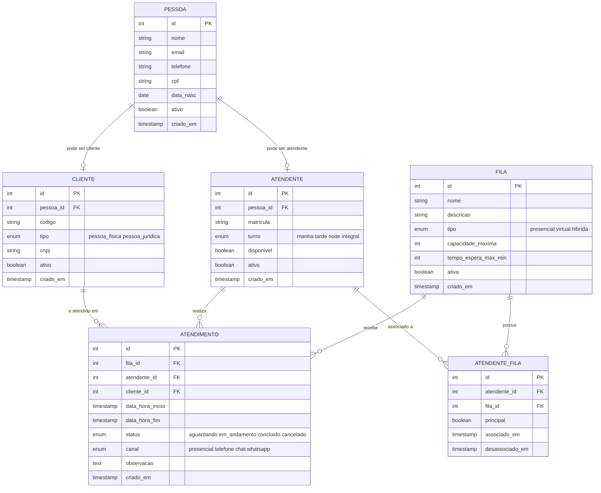

# Sistema-de-Atendimento

## 📌 Tema
Sistema de Atendimento

---

## 🎯 Objetivo Geral
Desenvolver um sistema capaz de gerenciar o fluxo de atendimentos de uma empresa, permitindo o controle eficiente de filas, cadastro de clientes e atendentes, além do registro detalhado de cada atendimento realizado (data, hora, responsável e cliente atendido). O sistema busca otimizar o tempo de espera, melhorar a organização e aumentar a qualidade do atendimento.

---

## 👥 Público-Alvo
O sistema é voltado para empresas e organizações que realizam atendimentos ao público, como bancos, clínicas, repartições públicas, lojas e centrais de suporte. Também atende gestores e atendentes que precisam organizar e acompanhar o fluxo de clientes de forma prática e eficiente.

---

## 👨‍💻 Alunos
- Carlos Eduardo Passos Silva
- Eduardo Micael Saraiva Maia
- Joaquim
- Lucas
- Renato

---

## 🗃️ Modelo de Dados



O banco é composto pelas seguintes entidades:

| Tabela | Descrição |
|---|---|
| `pessoa` | Base de dados de todas as pessoas (clientes e atendentes) |
| `cliente` | Pessoas cadastradas como clientes (PF ou PJ) |
| `atendente` | Funcionários que realizam atendimentos |
| `fila` | Filas de atendimento (presencial, virtual ou híbrida) |
| `atendente_fila` | Associação entre atendentes e filas |
| `atendimento` | Registro de cada atendimento realizado |

### 🔗 Relacionamentos
- Uma `pessoa` pode ser `cliente` e/ou `atendente`
- Um `atendente` pode estar associado a várias `filas` (tabela `atendente_fila`)
- Um `atendimento` pertence a uma `fila`, é realizado por um `atendente` e atende um `cliente`
- O campo `principal` em `atendente_fila` indica o atendente responsável por aquela fila

---

## 📁 Estrutura do Repositório

```
scripts/
├── v1__create_table_pessoa.sql
├── v1__create_table_cliente.sql
├── v1__create_table_atendente.sql
├── v1__create_table_fila.sql
├── v1__create_table_atendente_fila.sql
├── v1__create_table_atendimento.sql
├── v2__insert_into_pessoa.sql
├── v2__insert_into_cliente.sql
├── v2__insert_into_atendente.sql
├── v2__insert_into_fila.sql
├── v2__insert_into_atendente_fila.sql
├── v2__insert_into_atendimento.sql
└── v2__update_delete_validacao.sql
```

### Convenção de nomes dos arquivos
```
[Versão]__[acao]_[descricao/objeto].sql
```
- `v1__` → scripts de estrutura (DDL)
- `v2__` → scripts de dados (DML)

---

## 🚀 Como executar

### Pré-requisitos
- PostgreSQL instalado (versão 13 ou superior)
- Um banco de dados criado previamente

### Passo a passo

1. Clone o repositório:
```bash
git clone https://github.com/seu-usuario/Sistema-de-Atendimento.git
cd Sistema-de-Atendimento/scripts
```

2. Execute os scripts DDL na ordem:
```bash
psql -U seu_usuario -d seu_banco -f v1__create_table_pessoa.sql
psql -U seu_usuario -d seu_banco -f v1__create_table_cliente.sql
psql -U seu_usuario -d seu_banco -f v1__create_table_atendente.sql
psql -U seu_usuario -d seu_banco -f v1__create_table_fila.sql
psql -U seu_usuario -d seu_banco -f v1__create_table_atendente_fila.sql
psql -U seu_usuario -d seu_banco -f v1__create_table_atendimento.sql
```

3. Execute os scripts DML na ordem:
```bash
psql -U seu_usuario -d seu_banco -f v2__insert_into_pessoa.sql
psql -U seu_usuario -d seu_banco -f v2__insert_into_cliente.sql
psql -U seu_usuario -d seu_banco -f v2__insert_into_atendente.sql
psql -U seu_usuario -d seu_banco -f v2__insert_into_fila.sql
psql -U seu_usuario -d seu_banco -f v2__insert_into_atendente_fila.sql
psql -U seu_usuario -d seu_banco -f v2__insert_into_atendimento.sql
psql -U seu_usuario -d seu_banco -f v2__update_delete_validacao.sql
```

> ⚠️ **Atenção:** respeite a ordem de execução para não violar as restrições de chave estrangeira.

---

## 🛠️ Tecnologia
- **SGBD:** PostgreSQL
- **Linguagem:** SQL (DDL + DML)
