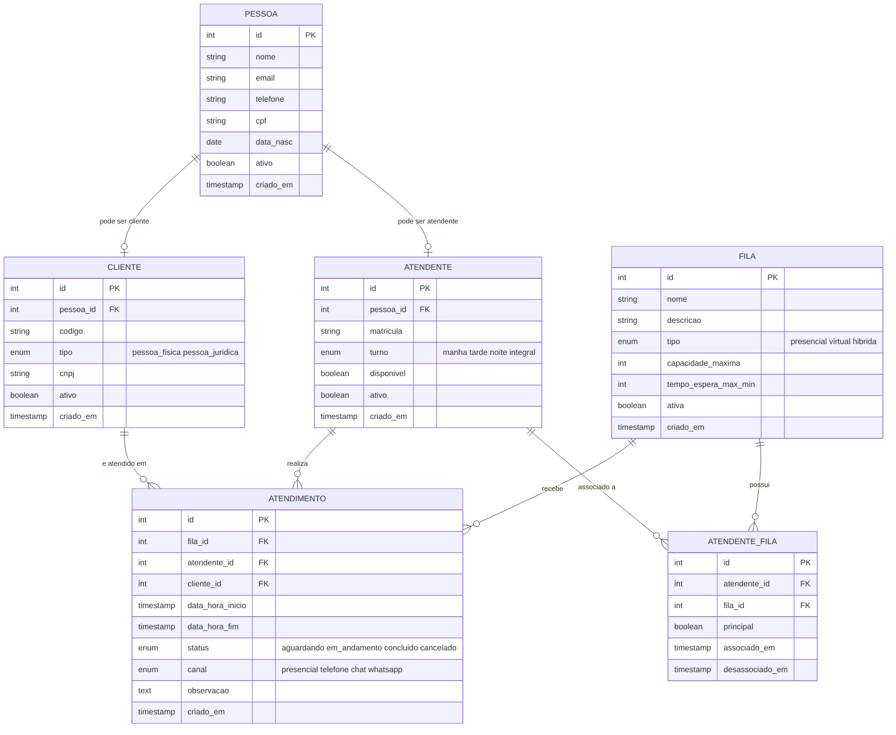

# Sistema-de-Atendimento

## 📌 Tema
Sistema de Atendimento

---

## 🎯 Objetivo Geral
Desenvolver um sistema capaz de gerenciar o fluxo de atendimentos de uma empresa, permitindo o controle eficiente de filas, cadastro de clientes e atendentes, além do registro detalhado de cada atendimento realizado (data, hora, responsável e cliente atendido). O sistema busca otimizar o tempo de espera, melhorar a organização e aumentar a qualidade do atendimento.

---

## 👥 Público-Alvo
O sistema é voltado para empresas e organizações que realizam atendimentos ao público, como bancos, clínicas, repartições públicas, lojas e centrais de suporte. Também atende gestores e atendentes que precisam organizar e acompanhar o fluxo de clientes de forma prática e eficiente.

---

## 👨‍💻 Alunos
- Carlos Eduardo Passos Silva
- Eduardo Micael Saraiva Maia
- Joaquim Camillo pereira neto
- Lucas Gabriel Barreto Oliveira
- Renato Luiz

---

## 🗃️ Modelo de Dados



O banco é composto pelas seguintes entidades:

| Tabela | Descrição |
|---|---|
| `pessoa` | Base de dados de todas as pessoas (clientes e atendentes) |
| `cliente` | Pessoas cadastradas como clientes (PF ou PJ) |
| `atendente` | Funcionários que realizam atendimentos |
| `fila` | Filas de atendimento (presencial, virtual ou híbrida) |
| `atendente_fila` | Associação entre atendentes e filas |
| `atendimento` | Registro de cada atendimento realizado |

### 🔗 Relacionamentos
- Uma `pessoa` pode ser `cliente` e/ou `atendente`
- Um `atendente` pode estar associado a várias `filas` (tabela `atendente_fila`)
- Um `atendimento` pertence a uma `fila`, é realizado por um `atendente` e atende um `cliente`
- O campo `principal` em `atendente_fila` indica o atendente responsável por aquela fila

---

## 📁 Estrutura do Repositório

```
scripts/
├── v1__create_table_pessoa.sql
├── v1__create_table_cliente.sql
├── v1__create_table_atendente.sql
├── v1__create_table_fila.sql
├── v1__create_table_atendente_fila.sql
├── v1__create_table_atendimento.sql
├── v2__insert_into_pessoa.sql
├── v2__insert_into_cliente.sql
├── v2__insert_into_atendente.sql
├── v2__insert_into_fila.sql
├── v2__insert_into_atendente_fila.sql
├── v2__insert_into_atendimento.sql
└── v2__update_delete_validacao.sql
```

### Convenção de nomes dos arquivos
```
[Versão]__[acao]_[descricao/objeto].sql
```
- `v1__` → scripts de estrutura (DDL)
- `v2__` → scripts de dados (DML)

---

## 🚀 Como executar

### Pré-requisitos
- PostgreSQL instalado (versão 13 ou superior)
- Um banco de dados criado previamente

### Passo a passo

1. Clone o repositório:
```bash
git clone https://github.com/seu-usuario/Sistema-de-Atendimento.git
cd Sistema-de-Atendimento/scripts
```

2. Execute os scripts DDL na ordem:
```bash
psql -U seu_usuario -d seu_banco -f v1__create_table_pessoa.sql
psql -U seu_usuario -d seu_banco -f v1__create_table_cliente.sql
psql -U seu_usuario -d seu_banco -f v1__create_table_atendente.sql
psql -U seu_usuario -d seu_banco -f v1__create_table_fila.sql
psql -U seu_usuario -d seu_banco -f v1__create_table_atendente_fila.sql
psql -U seu_usuario -d seu_banco -f v1__create_table_atendimento.sql
```

3. Execute os scripts DML na ordem:
```bash
psql -U seu_usuario -d seu_banco -f v2__insert_into_pessoa.sql
psql -U seu_usuario -d seu_banco -f v2__insert_into_cliente.sql
psql -U seu_usuario -d seu_banco -f v2__insert_into_atendente.sql
psql -U seu_usuario -d seu_banco -f v2__insert_into_fila.sql
psql -U seu_usuario -d seu_banco -f v2__insert_into_atendente_fila.sql
psql -U seu_usuario -d seu_banco -f v2__insert_into_atendimento.sql
psql -U seu_usuario -d seu_banco -f v2__update_delete_validacao.sql
```

> ⚠️ **Atenção:** respeite a ordem de execução para não violar as restrições de chave estrangeira.

---

## 🛠️ Tecnologia
- **SGBD:** PostgreSQL
- **Linguagem:** SQL (DDL + DML)

- # 🏥 Sistema de Gestão de Pessoas e Atendimentos

> Plataforma para cadastro de pessoas, registro e acompanhamento de atendimentos com rastreabilidade de histórico e alertas inteligentes.

---

## 📐 Diagrama de Entidade-Relacionamento (ER)

```
┌──────────────────────────────────────────────────────────────────────────┐
│                   DIAGRAMA ENTIDADE-RELACIONAMENTO v2.0                   │
└──────────────────────────────────────────────────────────────────────────┘

  ┌─────────────────────┐          ┌──────────────────────────┐
  │      USUARIOS       │          │   CATEGORIAS_ATENDIMENTO │
  │─────────────────────│          │──────────────────────────│
  │ PK id               │          │ PK id                    │
  │    nome             │          │    nome (UQ)             │
  │    email (UQ)       │          │    descricao             │
  │    senha_hash       │          │    ativo                 │
  │    perfil           │          │    criado_em             │
  │    ativo            │          └────────────┬─────────────┘
  │    criado_em        │                       │ 1
  │    atualizado_em    │                       │
  └──────────┬──────────┘                       │ N
             │                      ┌───────────┴──────────────────────┐
             │ 1                    │          ATENDIMENTOS             │
             │                      │──────────────────────────────────│
             ├─────────────────────N│ PK id                            │
             │  (usuario_id)        │    numero (UQ)                   │
             │                      │    pessoa_id    FK→pessoas        │
             │ 1                    │    usuario_id   FK→usuarios       │
             │                      │    categoria_id FK→cat_atend      │
             │  (criado_por)        │    status                        │
             │                      │    prioridade                    │
             ▼                      │    canal                         │
  ┌──────────────────────┐          │    descricao                     │
  │        PESSOAS       │          │    observacoes                   │
  │──────────────────────│          │    data_abertura                 │
  │ PK id                │1────────N│    data_conclusao                │
  │    nome              │          │    criado_em                     │
  │    cpf (UQ)          │          │    atualizado_em                 │
  │    data_nasc         │          └────────┬─────────────────────────┘
  │    genero            │                   │ 1
  │    email             │                   │
  │    telefone          │         ┌─────────┴──────────────────┐
  │    endereco          │         │                            │
  │    cidade            │         │ N (CASCADE)                │ N
  │    estado            │         ▼                            ▼
  │    cep               │  ┌────────────────────┐   ┌──────────────────────┐
  │    observacoes       │  │HISTORICO_ATENDIMENTO│   │    NOTIFICACOES      │
  │    ativo             │  │────────────────────│   │──────────────────────│
  │    criado_por (FK)   │  │ PK id              │   │ PK id                │
  │    criado_em         │  │    atendimento_id  │   │    usuario_id (FK)   │
  │    atualizado_em     │  │    usuario_id (FK) │   │    tipo              │
  └──────────────────────┘  │    status_anterior │   │    titulo            │
                             │    status_novo     │   │    mensagem          │
                             │    observacao      │   │    lida              │
                             │    criado_em       │   │    atendimento_id(FK)│
                             └────────────────────┘   │    criado_em        │
                                                       └──────────────────────┘

  ┌──────────────────────────────────────────────────┐
  │                  LOGS_ACESSO                     │
  │──────────────────────────────────────────────────│
  │ PK id                                            │
  │    usuario_id  FK → usuarios (SET NULL)          │
  │    acao                                          │
  │    tabela                                        │
  │    registro_id                                   │
  │    ip                                            │
  │    detalhe                                       │
  │    criado_em                                     │
  └──────────────────────────────────────────────────┘
  (N:1 com usuarios)
```

---

## 📋 Tabelas do Banco de Dados

### `usuarios`
| Coluna | Tipo | Restrição | Descrição |
|---|---|---|---|
| id | SERIAL | PK | Identificador único |
| nome | VARCHAR(120) | NOT NULL | Nome completo |
| email | VARCHAR(180) | UNIQUE, NOT NULL | E-mail de login |
| senha_hash | VARCHAR(255) | NOT NULL | Senha criptografada (bcrypt) |
| perfil | VARCHAR(30) | CHECK | `admin`, `gerente`, `operador` |
| ativo | BOOLEAN | DEFAULT TRUE | Status da conta |
| criado_em | TIMESTAMP | DEFAULT NOW | Data de criação |
| atualizado_em | TIMESTAMP | DEFAULT NOW | Última atualização |

---

### `pessoas`
| Coluna | Tipo | Restrição | Descrição |
|---|---|---|---|
| id | SERIAL | PK | Identificador único |
| nome | VARCHAR(150) | NOT NULL | Nome completo |
| cpf | CHAR(11) | UNIQUE | CPF sem pontuação |
| data_nasc | DATE | — | Data de nascimento |
| genero | CHAR(1) | CHECK | `M`, `F`, `O` |
| email | VARCHAR(180) | — | E-mail de contato |
| telefone | VARCHAR(20) | — | Telefone com DDD |
| endereco | VARCHAR(255) | — | Logradouro completo |
| cidade | VARCHAR(100) | — | Cidade |
| estado | CHAR(2) | — | UF |
| cep | CHAR(8) | — | CEP sem hífen |
| observacoes | TEXT | — | Observações gerais |
| ativo | BOOLEAN | DEFAULT TRUE | Status do cadastro |
| criado_por | INT | FK → usuarios | Usuário que cadastrou |
| criado_em | TIMESTAMP | DEFAULT NOW | Data de criação |
| atualizado_em | TIMESTAMP | DEFAULT NOW | Última atualização |

---

### `categorias_atendimento`
| Coluna | Tipo | Restrição | Descrição |
|---|---|---|---|
| id | SERIAL | PK | Identificador único |
| nome | VARCHAR(100) | UNIQUE, NOT NULL | Nome da categoria |
| descricao | TEXT | — | Detalhes da categoria |
| ativo | BOOLEAN | DEFAULT TRUE | Status |
| criado_em | TIMESTAMP | DEFAULT NOW | Data de criação |

---

### `atendimentos`
| Coluna | Tipo | Restrição | Descrição |
|---|---|---|---|
| id | SERIAL | PK | Identificador único |
| numero | VARCHAR(20) | UNIQUE, NOT NULL | Número sequencial do atendimento |
| pessoa_id | INT | FK → pessoas, NOT NULL | Pessoa atendida |
| usuario_id | INT | FK → usuarios, NOT NULL | Responsável pelo atendimento |
| categoria_id | INT | FK → categorias_atendimento | Tipo do atendimento |
| status | VARCHAR(30) | CHECK | `aberto`, `em_andamento`, `concluido`, `cancelado` |
| prioridade | VARCHAR(10) | CHECK | `baixa`, `normal`, `alta`, `urgente` |
| canal | VARCHAR(30) | CHECK | `presencial`, `telefone`, `email`, `chat`, `app` |
| descricao | TEXT | — | Descrição do atendimento |
| observacoes | TEXT | — | Observações adicionais |
| data_abertura | TIMESTAMP | DEFAULT NOW | Início do atendimento |
| data_conclusao | TIMESTAMP | — | Data de conclusão |
| criado_em | TIMESTAMP | DEFAULT NOW | Data de criação |
| atualizado_em | TIMESTAMP | DEFAULT NOW | Última atualização |

---

### `historico_atendimento` ⭐ *Inovação*
| Coluna | Tipo | Restrição | Descrição |
|---|---|---|---|
| id | SERIAL | PK | Identificador único |
| atendimento_id | INT | FK → atendimentos (CASCADE) | Atendimento relacionado |
| usuario_id | INT | FK → usuarios, NOT NULL | Usuário que fez a mudança |
| status_anterior | VARCHAR(30) | — | Status antes da mudança |
| status_novo | VARCHAR(30) | NOT NULL | Novo status aplicado |
| observacao | TEXT | — | Justificativa da mudança |
| criado_em | TIMESTAMP | DEFAULT NOW | Data/hora da mudança |

---

### `notificacoes` ⭐ *Inovação*
| Coluna | Tipo | Restrição | Descrição |
|---|---|---|---|
| id | SERIAL | PK | Identificador único |
| usuario_id | INT | FK → usuarios (SET NULL) | Destinatário |
| tipo | VARCHAR(60) | NOT NULL | Tipo do alerta (urgente, prazo, novo) |
| titulo | VARCHAR(200) | NOT NULL | Título da notificação |
| mensagem | TEXT | — | Conteúdo da notificação |
| lida | BOOLEAN | DEFAULT FALSE | Indica se foi lida |
| atendimento_id | INT | FK → atendimentos (SET NULL) | Atendimento associado |
| criado_em | TIMESTAMP | DEFAULT NOW | Data de criação |

---

### `logs_acesso`
| Coluna | Tipo | Restrição | Descrição |
|---|---|---|---|
| id | SERIAL | PK | Identificador único |
| usuario_id | INT | FK → usuarios (SET NULL) | Usuário que agiu |
| acao | VARCHAR(100) | NOT NULL | Ação realizada |
| tabela | VARCHAR(100) | — | Tabela afetada |
| registro_id | INT | — | ID do registro afetado |
| ip | VARCHAR(45) | — | Endereço IP |
| detalhe | TEXT | — | Detalhes adicionais |
| criado_em | TIMESTAMP | DEFAULT NOW | Data/hora do log |

---

## 🔗 Mapa de Relacionamentos

| Tabela Origem | Coluna FK | Tabela Destino | Cardinalidade | Ação |
|---|---|---|---|---|
| pessoas | criado_por | usuarios | N:1 | RESTRICT |
| atendimentos | pessoa_id | pessoas | N:1 | RESTRICT |
| atendimentos | usuario_id | usuarios | N:1 | RESTRICT |
| atendimentos | categoria_id | categorias_atendimento | N:1 | SET NULL |
| historico_atendimento | atendimento_id | atendimentos | N:1 | CASCADE |
| historico_atendimento | usuario_id | usuarios | N:1 | RESTRICT |
| notificacoes | usuario_id | usuarios | N:1 | SET NULL |
| notificacoes | atendimento_id | atendimentos | N:1 | SET NULL |
| logs_acesso | usuario_id | usuarios | N:1 | SET NULL |

---

## 🚀 Como usar

```bash
# PostgreSQL
psql -U postgres -d nome_do_banco -f schema.sql

# MySQL (requer adaptação: SERIAL → INT AUTO_INCREMENT, BOOLEAN → TINYINT(1))
mysql -u root -p nome_do_banco < schema.sql
```

---

## 🛡️ Inovações do Modelo

| # | Inovação | Tabela | Benefício |
|---|---|---|---|
| 1 | **Rastreabilidade de Fluxo** | `historico_atendimento` | Registra cada mudança de status com quem, quando e por quê |
| 2 | **Alertas Inteligentes** | `notificacoes` | Notificações automáticas de urgência e prazos |
| 3 | **Atendimento Multicanal** | `atendimentos.canal` | Suporte a presencial, telefone, e-mail, chat e app |
| 4 | **Triagem por Prioridade** | `atendimentos.prioridade` | Fila inteligente: baixa → normal → alta → urgente |
| 5 | **Auditoria Completa** | `logs_acesso` | Rastreia toda ação no sistema por IP e usuário |
